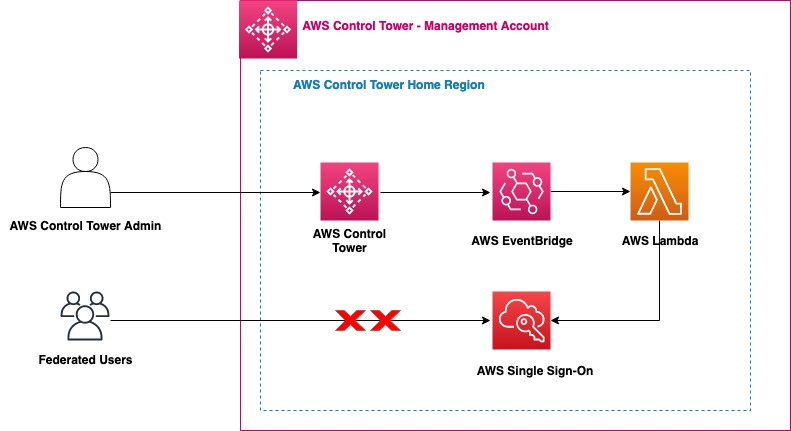

# Clear Unused AWS SSO Mappings Automatically During AWS Control Tower Upgrades

Increasingly organizations are using [AWS Control Tower](https://docs.aws.amazon.com/controltower/latest/userguide/what-is-control-tower.html) to manage their multiple accounts as well as an external third-party identity source for their federation needs. Cloud architects who use these external identity sources, needed an automated way to clear the unused maps created by AWS Control Tower landing zone as part of the launch, or during update and repair operations. Though the [AWS SSO](https://aws.amazon.com/single-sign-on/) mappings are inaccessible once the external identity source is configured, customers prefer to clear any unused mappings in the directory.

You can remove the permissions sets and mappings that AWS Control Tower deployment creates in AWS SSO. However, when the landing zone is updated or repaired, the default permission sets and mappings are recreated in AWS SSO. In this blog post, we show you how to use [AWS Control Tower Lifecycle events](https://docs.aws.amazon.com/controltower/latest/userguide/lifecycle-events.html) to automatically remove these permission sets and mappings when AWS Control Tower is upgraded or repaired. An AWS Lambda function runs on every upgrade and automatically removes the permission sets and mappings.

## Solution Overview

Using this [CloudFormation template](https://github.com/aws-samples/aws-control-tower-reference-architectures/blob/master/customizations/SSOManagement/template/ct_sso_mappings_cleanup.yaml), you can deploy the solution that automatically removes the AWS SSO permission sets and mappings when you upgrade your AWS Control Tower environment. We use [AWS CloudFormation](https://aws.amazon.com/cloudformation/), [AWS Lambda](https://aws.amazon.com/lambda/), AWS SSO and [Amazon EventBridge](https://aws.amazon.com/eventbridge/) services to implement this solution.

To clear the AWS SSO entities and leave the service enabled with no active mappings, we recommend the following steps. This is mainly for those who do not want to use the default AWS SSO deployed by AWS Control Tower.

* Log in to the AWS Control Tower Management Account and make sure you are in the AWS Control Tower Home Region.
* Launch AWS CloudFormation stack, which creates:
    * An AWS Lambda function that:
        * Checks/Delete(s) the permission sets mappings created by AWS Control Tower, and
        * Deletes the permission sets created by AWS Control Tower.
* An AWS IAM role that is assigned to the preceding AWS Lambda Function with minimum required permissions.
* An Amazon CloudWatch Event Rule that is invoked upon `UpdateLandingZone` API and triggers the `ClearMappingsLambda` Lambda function

[Reference Blog](https://aws.amazon.com/blogs/architecture/field-notes-clear-unused-aws-sso-mappings-automatically-during-aws-control-tower-upgrades/)